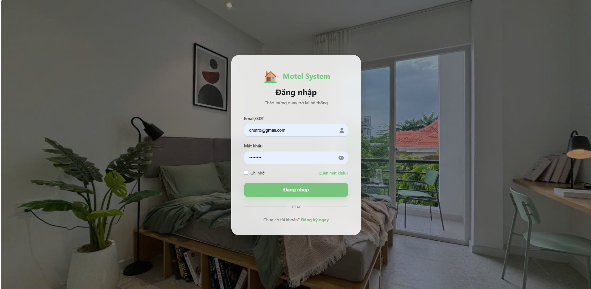
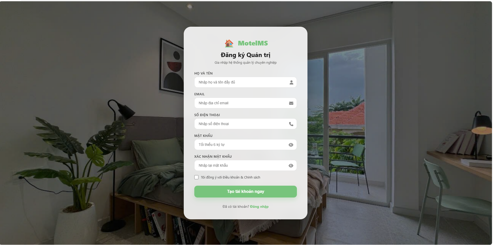
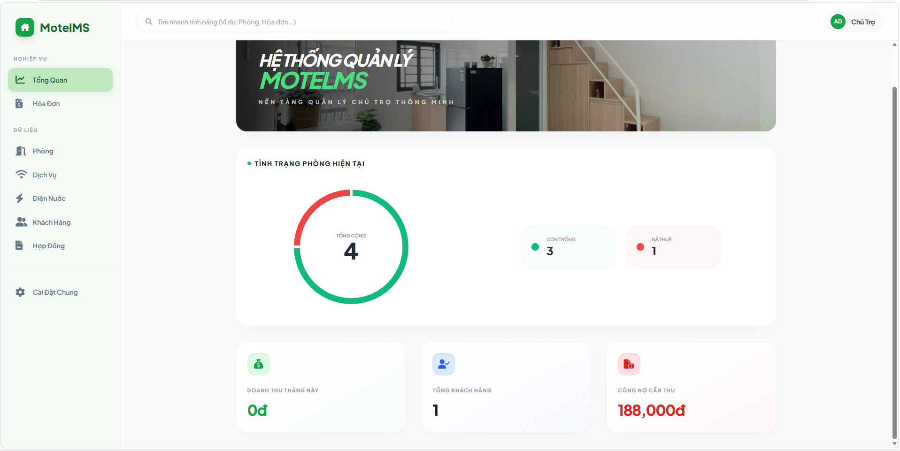
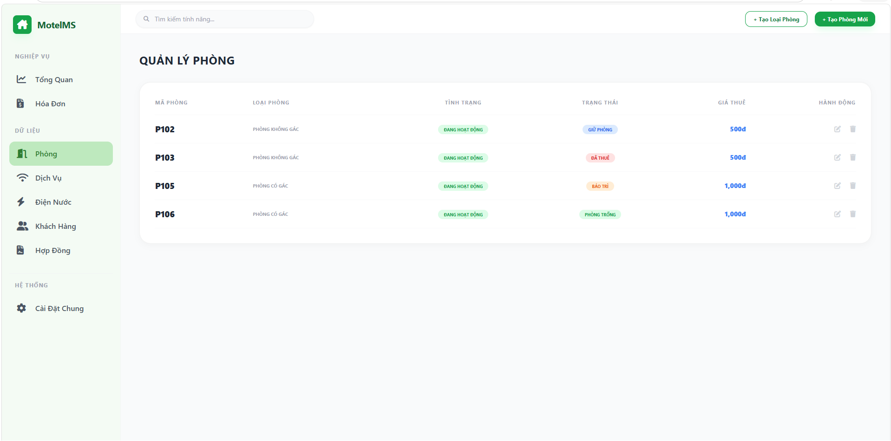
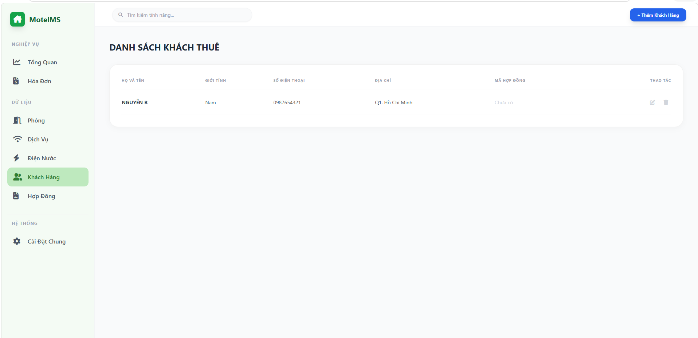
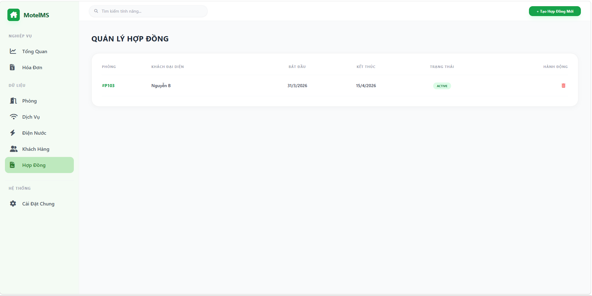
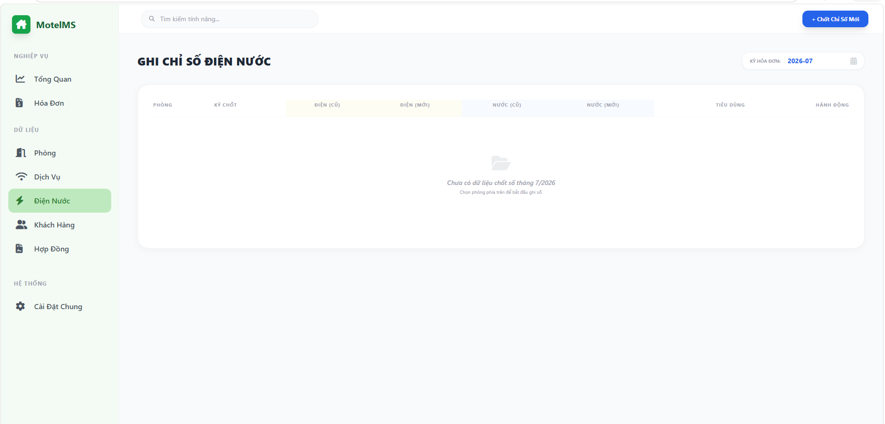
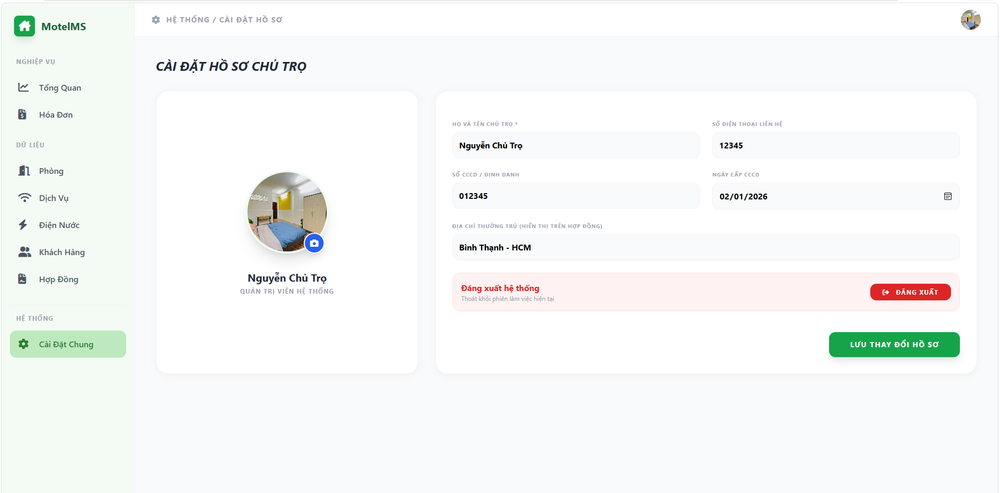

# Rental Management System

A full-stack web application that digitalizes boarding house operations by providing a centralized platform for managing rental properties, tenants, contracts, invoices, utility consumption, deposits, and business insights through an operational dashboard.

> **Object-Oriented Analysis and Design (OOAD) Course Project**  
> University of Science, VNU-HCM

---

# Business Context

Managing boarding houses manually with notebooks or spreadsheets often results in fragmented information, repetitive administrative work, and difficulties in tracking room occupancy, rental contracts, utility consumption, and monthly invoices.

The Rental Management System was developed to centralize these business processes into a single web application, enabling landlords to manage rental operations more efficiently while providing quick visibility into key operational metrics.

---

# Key Features

## Authentication

- Landlord account registration
- Secure login with JWT authentication
- Password recovery via email

---

## Business Dashboard

The dashboard provides an overview of rental operations, including:

- Room occupancy status
- Monthly revenue
- Total tenants
- Outstanding receivables

---

## Room Management

- Manage room information
- Manage room types
- Track room availability

---

## Tenant Management

- Manage tenant profiles
- Store rental information
- Search tenant records

---

## Contract Management

- Create rental contracts
- Renew contracts
- Terminate contracts

---

## Invoice & Utility Management

- Generate monthly invoices
- Record electricity consumption
- Record water consumption
- Manage service charges

---

## Deposit Management

- Record tenant deposits
- Track deposit information linked to rental contracts

---

## Notification Management

- View and manage system notifications

---

## System Settings

- Manage boarding house information
- Configure application settings

---

# Screenshots

## Login



## Register



## Dashboard



## Room Management



## Tenant Management



## Contract Management



## Invoice Management


## Utility Management



## Settings



---

# Technology Stack

### Backend

- Node.js
- Express.js
- RESTful API
- JWT Authentication
- bcryptjs
- Multer
- Nodemailer

### Frontend

- HTML5
- CSS3
- JavaScript (Vanilla JavaScript)

### Database

- Microsoft SQL Server

### Tools

- Git
- GitHub
- Visual Studio Code
- SQL Server Management Studio (SSMS)

---

# System Architecture

```text
Frontend (HTML/CSS/JavaScript)
            │
            ▼
      Express RESTful API
            │
            ▼
    Microsoft SQL Server
```

---

# Project Structure

```text
Rental-Management-System
│
├── backend
│   ├── src
│   │   ├── config
│   │   ├── controllers
│   │   ├── middlewares
│   │   ├── routes
│   │   ├── utils
│   │   ├── app.js
│   │   └── server.js
│   ├── package.json
│   ├── .env.example
│   
│
├── frontend
│   ├── admin
│   ├── auth
│   ├── assets
│   └── index.html
│
├── database
│   └── csdl_quanlytro.sql
│
├── docs
│   └── screenshots
│
├── README.md
└── .gitignore
```

---

# Installation

## Clone Repository

```bash
git clone https://github.com/huyentrann204/rental-management-system.git
```

---

## Backend

```bash
cd backend
npm install
```

Create a `.env` file using `.env.example` as a template.

Run the backend:

```bash
npm start
```

or

```bash
node src/server.js
```

Backend URL

```
http://localhost:3000
```

---

## Database

Import

```
database/csdl_quanlytro.sql
```

into Microsoft SQL Server.

---

## Frontend

Run

```
frontend/index.html
```

using **Live Server**.

---

# Environment Variables

Create a `.env` file inside the `backend` folder.

```env
DB_SERVER=localhost
DB_NAME=your_database_name
DB_USER=your_username
DB_PASSWORD=your_password
DB_PORT=1433

JWT_SECRET=your_jwt_secret

EMAIL_USER=your_email@example.com
EMAIL_PASSWORD=your_email_app_password
```

---

# My Role

Although this project was completed as part of a university team assignment, I was responsible for designing and developing the complete software system, including:

- Business requirement analysis
- Database design
- System architecture design
- Backend development using Node.js and Express
- RESTful API development
- JWT authentication and authorization
- Microsoft SQL Server integration
- Frontend development using HTML, CSS, and JavaScript
- Business dashboard implementation
- Room, tenant, contract, invoice, utility, deposit, notification, and settings modules
- System integration, testing, and deployment

---

# Future Improvements

- Responsive user interface
- Role-based access control
- Online payment integration
- Maintenance request management
- Business analytics dashboard
- Docker deployment
- Unit and integration testing

---

# Acknowledgements

This project was developed as part of the **Object-Oriented Analysis and Design (OOAD)** course at the **University of Science, VNU-HCM**.

---

# License

This project is intended for educational psurposes.