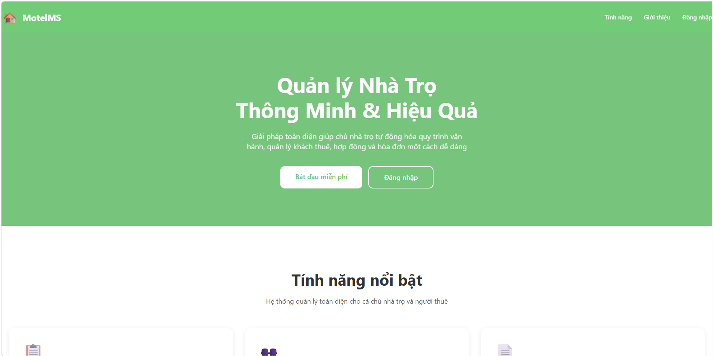
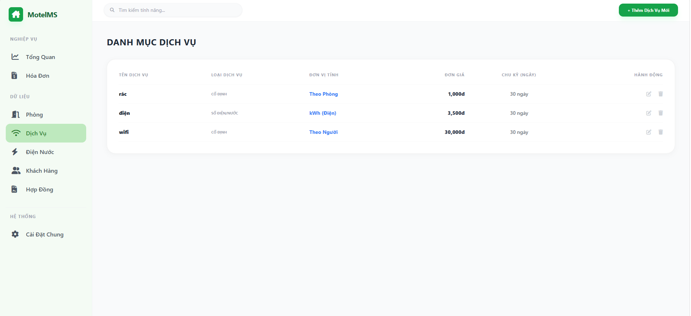

# Rental Management System



A full-stack web application that digitalizes boarding house operations by centralizing business processes, automating rental workflows, and providing operational insights through an interactive dashboard.

> **Object-Oriented Analysis and Design (OOAD) Course Project**  
> **University of Science, VNU-HCM**

---

# Table of Contents

- [Business Context](#business-context)
- [Key Features](#key-features)
- [Screenshots](#screenshots)
- [Technology Stack](#technology-stack)
- [System Architecture](#system-architecture)
- [Project Structure](#project-structure)
- [Installation](#installation)
- [Environment Variables](#environment-variables)
- [My Role](#my-role)
- [Future Improvements](#future-improvements)
- [Acknowledgements](#acknowledgements)
- [License](#license)

---

# Business Context

Managing boarding houses manually using notebooks or spreadsheets often leads to fragmented information, repetitive administrative work, and difficulties in tracking room occupancy, rental contracts, utility consumption, and monthly invoices.

The Rental Management System centralizes rental operations into a single web application, reducing manual processes, improving data consistency, and providing landlords with real-time visibility into occupancy, revenue, tenant information, and outstanding receivables.

---

# Key Features

## Authentication

- Landlord account registration
- Secure login using JSON Web Token (JWT)
- Password recovery via email

---

## Business Dashboard

The dashboard enables landlords to monitor key business metrics in real time, including:

- Room occupancy status
- Monthly revenue
- Total tenants
- Outstanding receivables

---

## Room Management

- Manage room information
- Manage room types
- Track room availability

---

## Tenant Management

- Manage tenant profiles
- Store tenant rental information
- Search tenant records

---

## Contract Management

- Create rental contracts
- Renew contracts
- Terminate contracts

---

## Invoice & Utility Management

- Generate monthly invoices
- Record electricity consumption
- Record water consumption
- Manage service charges

---

## Deposit Management

- Record tenant deposits
- Track deposit information linked to rental contracts

---

## System Settings

- Manage boarding house information
- Configure application settings

---

# Screenshots

## Login


---

## Register


---

## Dashboard


---

## Room Management


---

## Tenant Management


---

## Contract Management


---

## Invoice Management


---

## Utility Management


---

## Service Management



---

## System Settings


---

# Technology Stack

## Backend

- Node.js
- Express.js
- RESTful API
- JSON Web Token (JWT)
- bcryptjs
- Multer
- Nodemailer

## Frontend

- HTML5
- CSS3
- JavaScript (Vanilla JavaScript)

## Database

- Microsoft SQL Server

## Development Tools

- Git
- GitHub
- Visual Studio Code
- SQL Server Management Studio (SSMS)

---

# System Architecture

```text
                           +----------------------+
                           |      Frontend        |
                           | HTML • CSS • JS      |
                           +----------+-----------+
                                      |
                              HTTP / REST API
                                      |
                                      ▼
                           +----------------------+
                           |   Express Backend    |
                           | Authentication       |
                           | Business Logic       |
                           +----------+-----------+
                                      |
                                SQL Queries
                                      |
                                      ▼
                           +----------------------+
                           | Microsoft SQL Server |
                           |      Database        |
                           +----------------------+
```

---

# Project Structure

```text
Rental-Management-System
│
├── backend
│   ├── src
│   │   ├── config
│   │   ├── controllers
│   │   ├── middlewares
│   │   ├── routes
│   │   ├── app.js
│   │   └── server.js
│   ├── package.json
│   ├── package-lock.json
│   ├── .env.example
│   └── .gitignore
│
├── frontend
│   ├── admin
│   ├── auth
│   ├── assets
│   └── index.html
│
├── database
│   └── csdl_quanlytro.sql
│
├── docs
│   └── screenshots
│
├── README.md
└── .gitignore
```

---

# Installation

## Clone Repository

```bash
git clone https://github.com/huyentrann204/rental-management-system.git
```

---

## Backend Setup

Install dependencies:

```bash
cd backend
npm install
```

Create a `.env` file based on `.env.example`.

Start the backend server:

```bash
npm start
```

or

```bash
node src/server.js
```

Backend URL:

```
http://localhost:3000
```

---

## Database Setup

Import the SQL script:

```
database/csdl_quanlytro.sql
```

into Microsoft SQL Server.

---

## Frontend Setup

Run

```
frontend/index.html
```

using **Live Server** in Visual Studio Code.

---

# Environment Variables

Create a `.env` file inside the `backend` folder.

```env
DB_SERVER=localhost
DB_NAME=your_database_name
DB_USER=your_username
DB_PASSWORD=your_password
DB_PORT=1433

JWT_SECRET=your_jwt_secret

EMAIL_USER=your_email@example.com
EMAIL_PASSWORD=your_email_app_password
```

---

# My Role

Although this project was developed as part of a university team assignment, I was responsible for the end-to-end software development, including:

- Business requirement analysis
- Database design
- System architecture design
- Backend development using Node.js and Express.js
- RESTful API development
- Authentication and authorization using JWT
- Microsoft SQL Server integration
- Frontend development using HTML, CSS, and JavaScript
- Business dashboard implementation
- Development of room, tenant, contract, invoice, utility, deposit, notification, and settings modules
- System integration, testing, and deployment

---

# Future Improvements

- Responsive user interface
- Role-based access control
- Online payment integration
- Maintenance request management
- Interactive business intelligence dashboard
- Docker deployment
- Unit and integration testing

---

# Acknowledgements

This project was developed as part of the **Object-Oriented Analysis and Design (OOAD)** course at the **University of Science, VNU-HCM**.

---

# License

This project is intended for educational purposes.